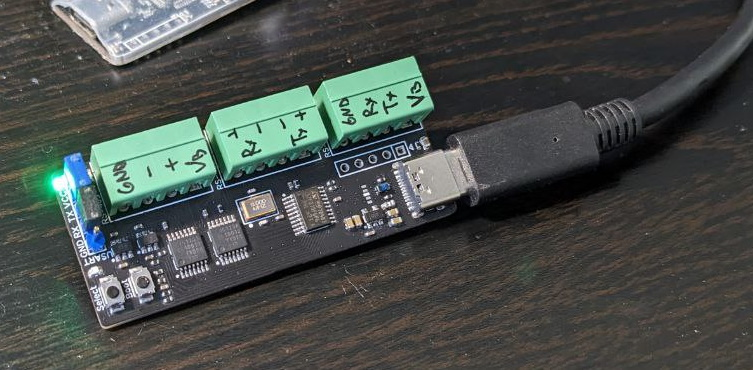
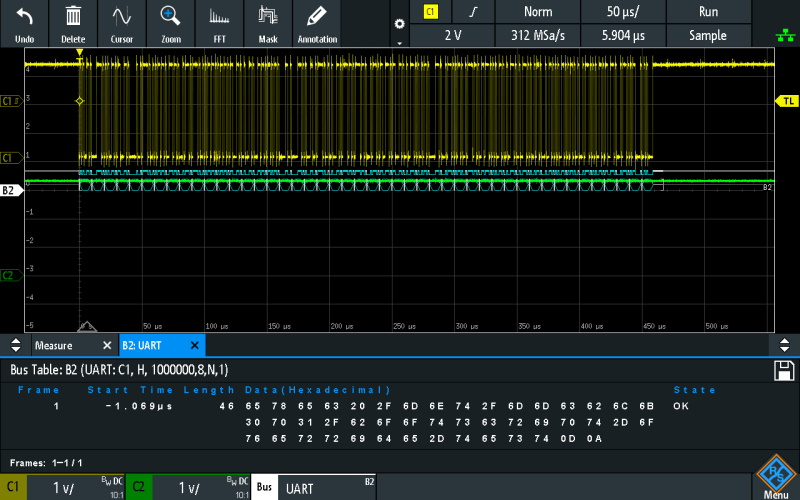
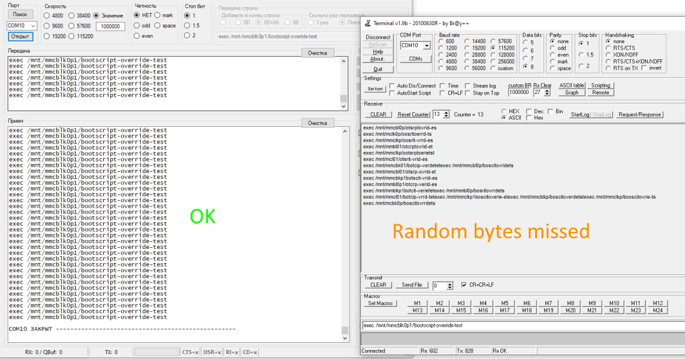

# USB-Serial Debug Tool

Simple USB-Serial debug tool (work as VCP), can operate in one of selected by single button modes:
* USB to TTL (with build-in level converter, default IO level is 3.3V, but user can connect external VCCIO in range 1,4...3,6V)
* USB to RS-232 (only RX\TX)
* USB to RS-485
* USB to RS-422

MCU can be flash without external flasher\debugger by using internal bootloader, what is activated by pressing boot button before connecting device via USB.

**Hardware**

* MCU:               STM32F070F6P6 (can be replaced with STM32F042F6P6 wich have internal oscillator)
* Bus buffer:        SN74LVC125APWR
* Level converter:   SN74AVC1T45DBVR (can be replaced with SN74LVC1T45DBVR to extand VCCIO range to 1,65...5,5V)
* RS-232 driver:     ADM3101EACPZ (not nessesary, if you don't need RS-232)
* RS-485 driver:     ADM3485EARZ (can be replaced with TP75176E-FR or SIT3088ETK in DFN-8)
* RS-422 driver:     ADM3077EARZ (can be replaced with SP3490EN-L/TR)

**Firmware**

Makefile project, adapted to using with Visual Studio Code and J-Link Debugger.
Compilled with GCC (arm-none-eabi-gcc).
Based on generated project by STM32CubeMX and in firmware implimented simple bidirectional bridge:
USB <-> DMA <-> USART

User led on PCB is blinking when data was received from any serial interface (not USB).
User button is used to select next serial interface in circle (->USART->RS485->RS422->RS232->).

Simple test with band 1000000 show what all work fine, when sending one big string (command):

Issue with missed random bytes is observe, when used "Terminal v1.9b":

"Terminal v1.9b" is polling (both ways, RX and TX) COM port and when you send one string, this software send it one by one byte with not determined delay...
That's why VCP on STM32 can't work properly. If you use normal terminal software on PC - all works fine. :)

**Software**

WIP...
